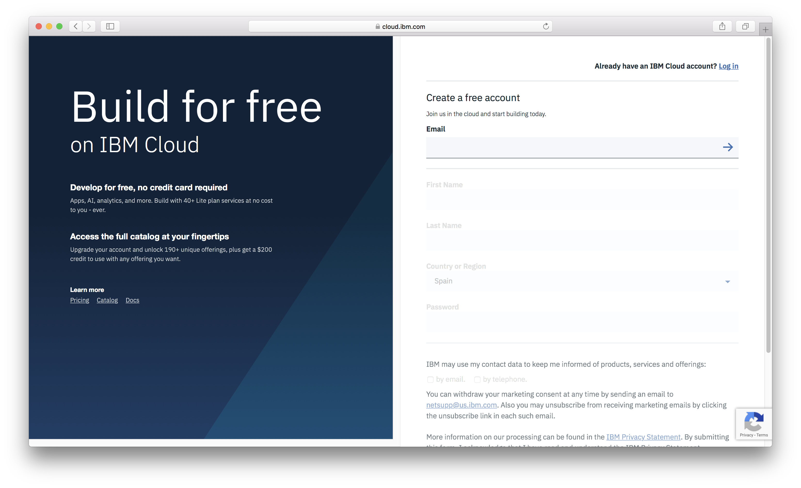
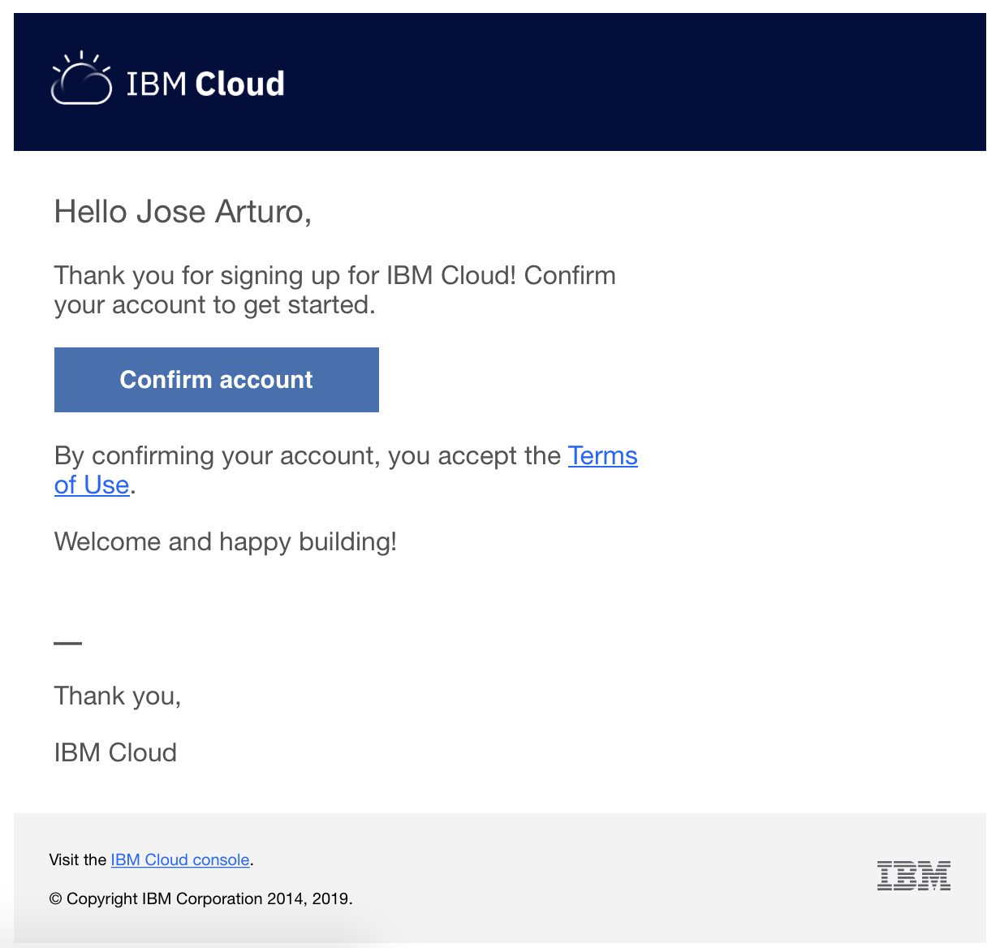
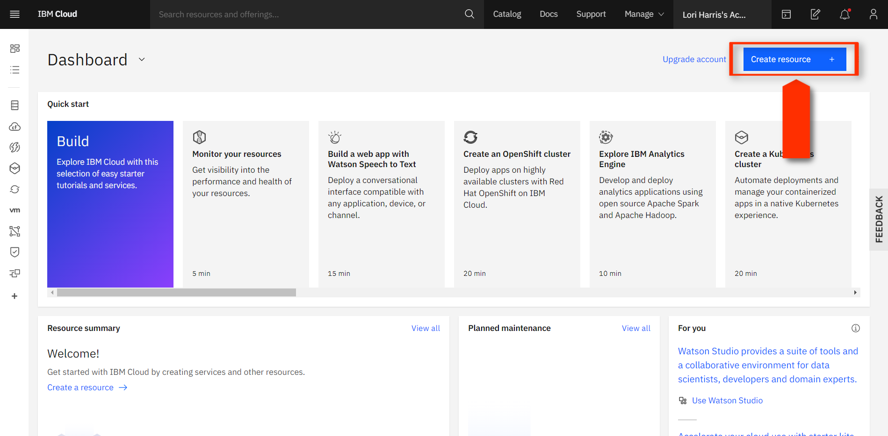
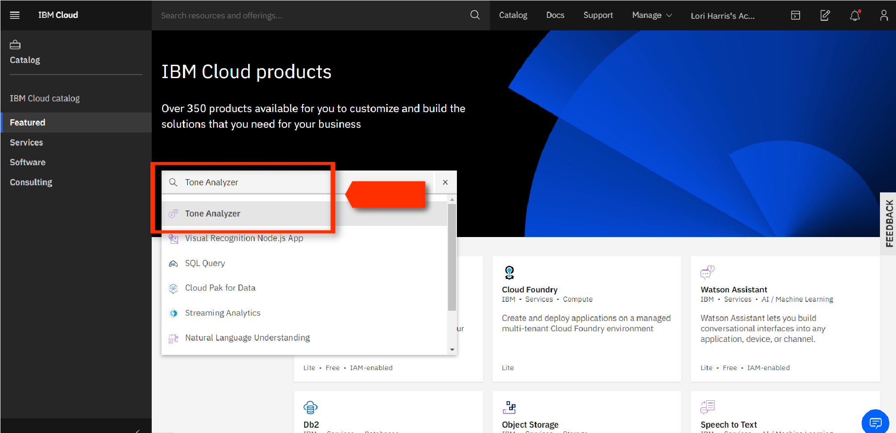
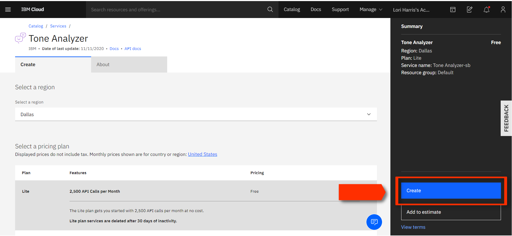
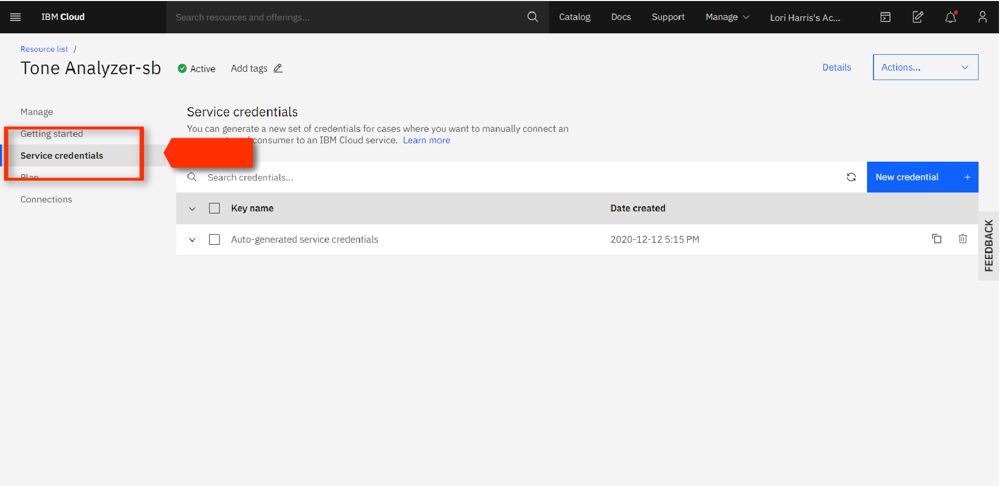
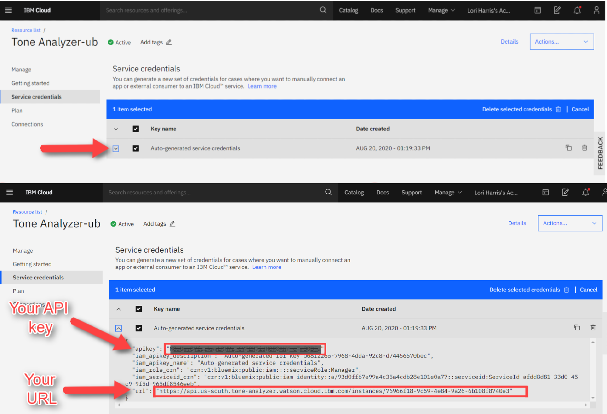

## How to set up IBM Tone Analyzer

**Corresponding Activity:** [07-Ins_Tone_Analysis](Activities/07-Ins_Tone_Analysis)

Here is [the URL for Tone Analyzer](https://cloud.ibm.com/catalog/services/tone-analyzer), please go ahead and create your free IBM Cloud account.

* Please select the Lite plan of Tone Analyzer, it allows 2,500 API calls per month for free, and no credit card is required to use it.

* You only need to fill out their personal account information on the registration form.

  

* After fill out the form, you will receive an email and have to click on the "Confirm account" button to start using the Tone Analyzer service.

  

* After the new IBM Cloud account is confirmed, you should be able to see your dashboard. The "Create resource" button should be clicked to continue.

  

Once you have access to your IBM Cloud dashboard, you need to create an instance of the Tone Analyzer Service. At the Catalog, type `label:lite tone analyzer` in the search box to find the service. Once the service appears in the results, click on the "Tone Analyzer Service" to configure the instance.

  

* To create the Tone Analyzer instance, just the "Service name" should be provided on the Tone Analyzer configuration page. After the "Create" button is clicked, the instance is ready to be used.

  

Now that the Tone Analyzer instance is ready to use, go get your API keys and the instance URL by clicking on the "Service credentials" link.

  

* On the resulting page, next to the _Auto-generated service credentials_ section, click the down arrow to expand the selection. 

* You should see the API key and the instance URL as it's shown below. 

  